# 📊 E-Commerce Customer Behavior Analysis
## 📄Page 1

### Summary
- Analyze customer age distribution.
- Identify the most common age group.
- Understand customer demographic patterns.

  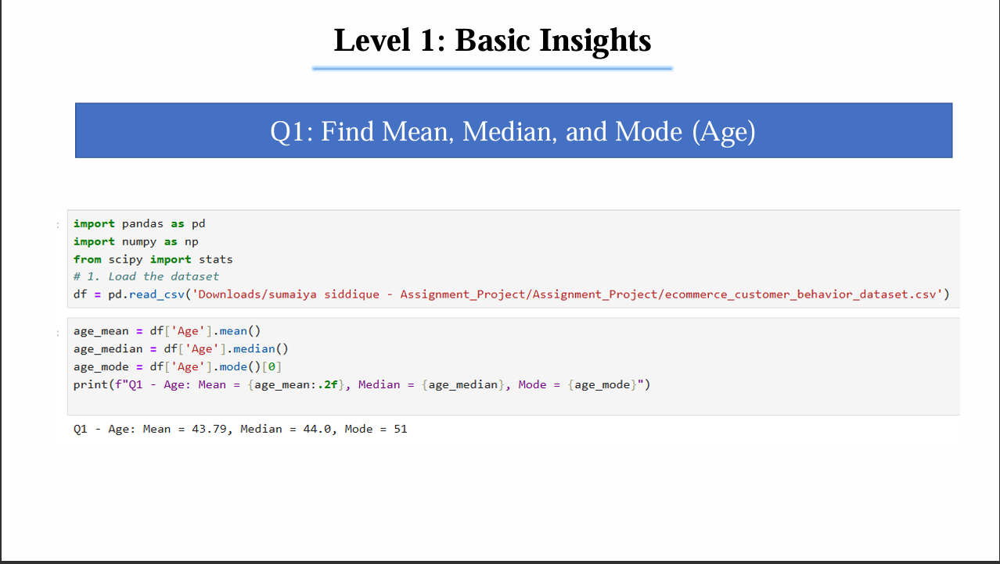

## 📄Page 2

### Summary
- Measure variation in customer spending.
- Identify the most popular product categories.
- Understand purchasing trends across products.

  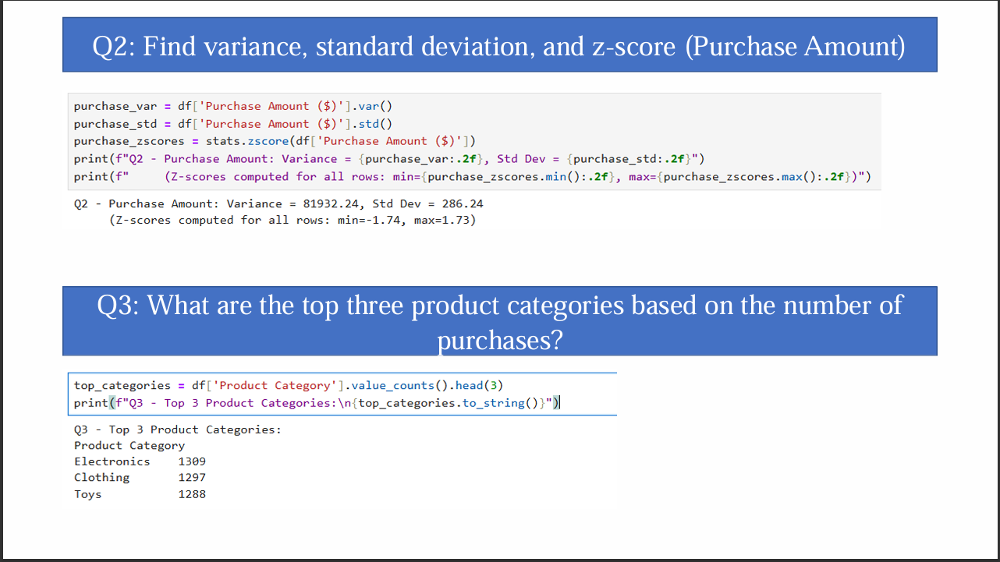

## 📄Page 3

### Summary
- Evaluate customer retention behavior.
- Measure overall customer satisfaction.
- Compare delivery performance across subscription types.

  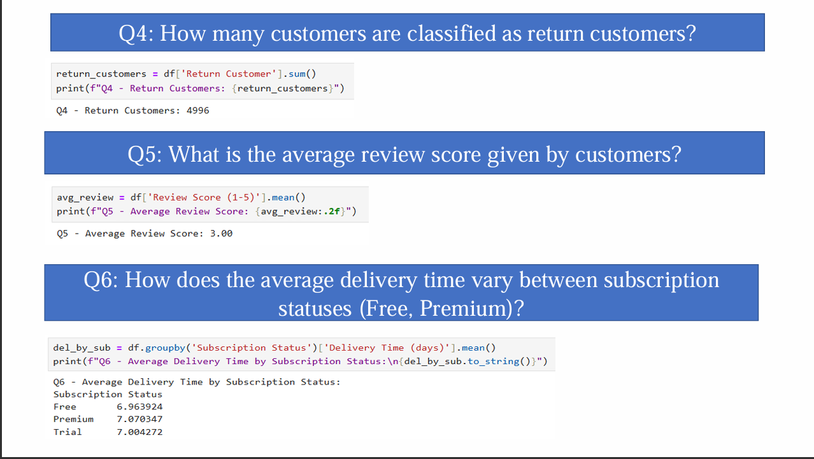

## 📄Page 4

### Summary
- Analyze subscription adoption among customers.
- Understand customer device preferences.
- Compare purchasing behavior across devices.

  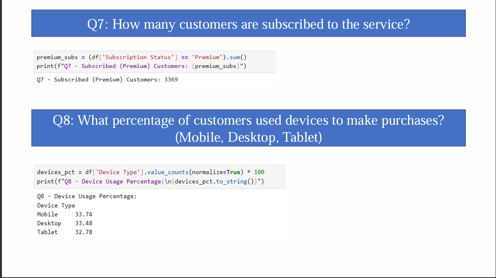

## 📄Page 5

### Summary
- Assess the impact of discounts on spending.
- Identify preferred payment methods.
- Understand customer purchasing patterns.

  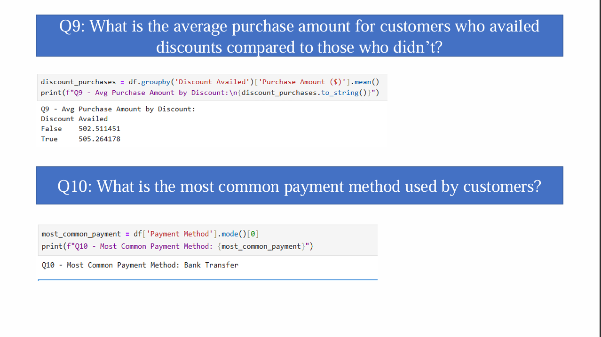

## 📄Page 6

### Summary
- Evaluate customer satisfaction by payment method.
- Analyze the relationship between website engagement and spending.
- Identify factors influencing purchase behavior.

  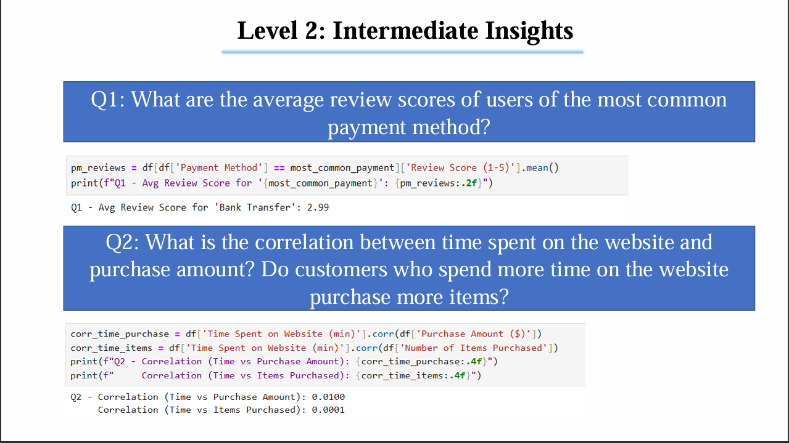

## 📄Page 7

### Summary
- Measure customer loyalty and satisfaction levels.
- Explore the connection between purchase quantity and satisfaction.
- Identify high-performing customer locations.

  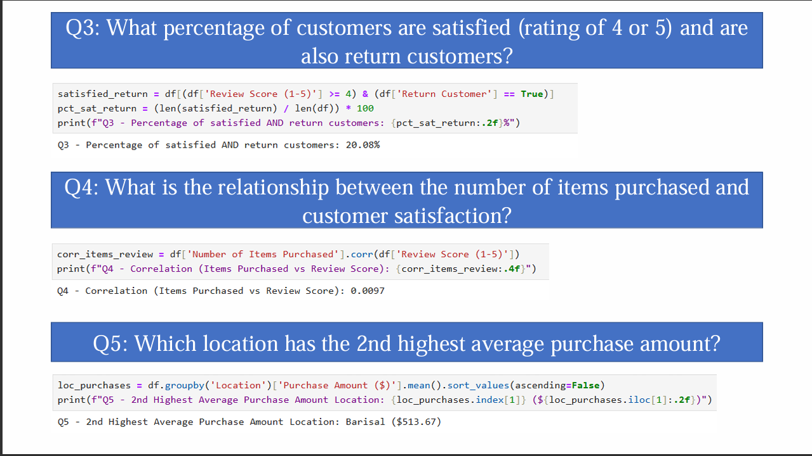

## 📄Page 8

### Summary
- Identify factors that encourage repeat purchases.
- Understand customer retention drivers.
- Analyze behaviors associated with returning customers.

  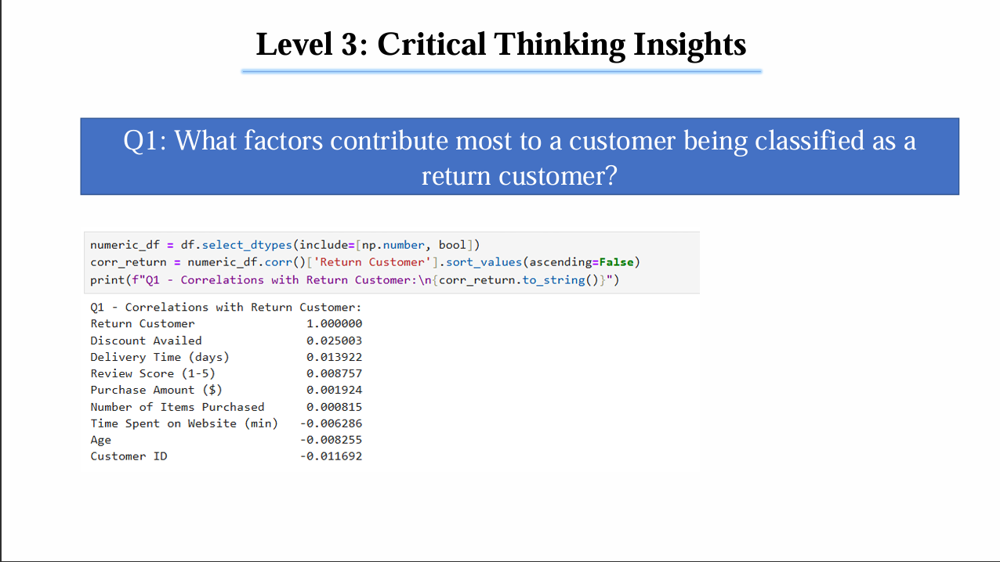

## 📄Page 9

### Summary
- Examine the impact of payment methods on customer experience.
- Compare satisfaction and retention across payment options.
- Identify payment methods associated with loyal customers.

  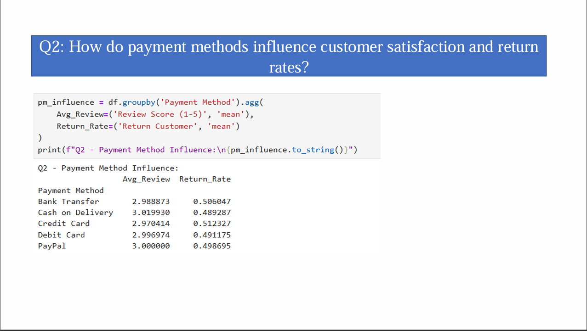

## 📄Page 10

### Summary
- Analyze regional purchasing behavior.
- Compare delivery performance across locations.
- Identify location-based business opportunities.

  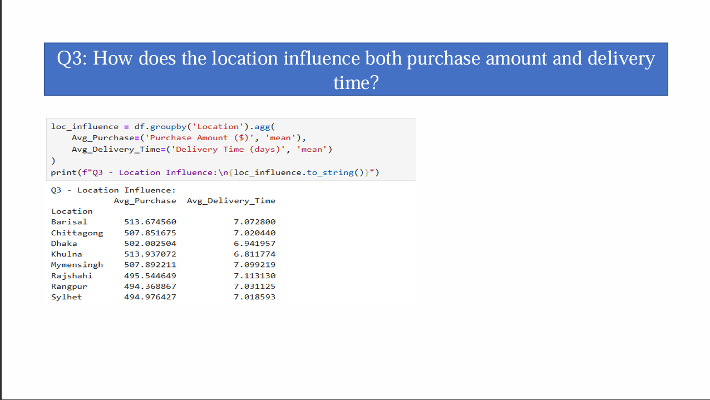

## 📄Page 11

### Summary
- Highlight key business insights from the analysis.
- Identify major factors affecting customer satisfaction and retention.
- Provide recommendations for improving customer experience and sales performance.

  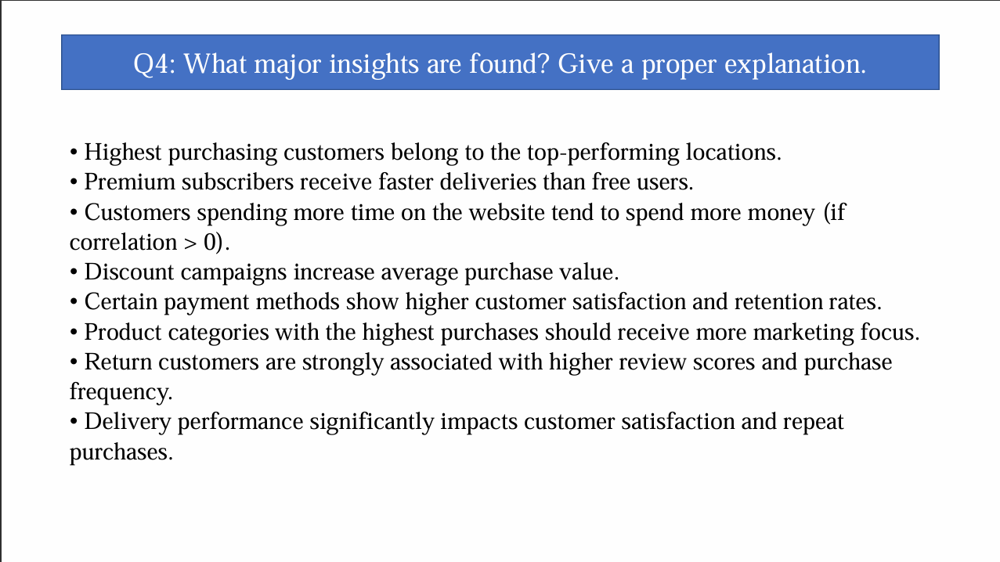

---

# Overall Project Summary

This analysis explores customer demographics, purchasing behavior, satisfaction levels, payment preferences, delivery performance, and retention patterns. The insights help businesses make data-driven decisions to improve customer experience, increase sales, optimize marketing strategies, and strengthen customer loyalty.
